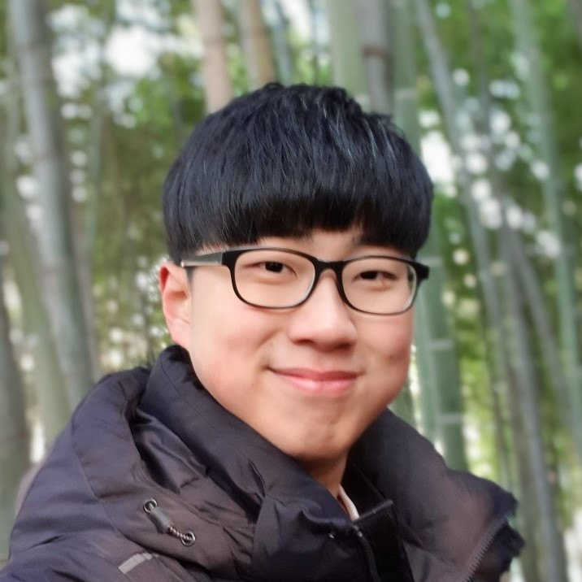

{: width="30%" height="30%"}
Ph.D Candidate @ KAIST, ISysE.

E-mail: <wp03052@kaist.ac.kr> | <byeonghu.na@kaist.ac.kr> | <gwp03052@gmail.com>

### Education
> **KAIST, Daejeon, Korea, Ph.D.** *(Mar. 2021 - Present)*  
> * Applied Artificial Intelligence Laboratory (AAILab)  
> * Department of Industrial & Systems Engineering (ISysE)  
> * GPA: 4.22/4.3  
> * Advisor: Prof. Il-Chul Moon  

> **KAIST, Daejeon, Korea, M.S.** *(Feb. 2019 - Feb. 2021)*  
> * Applied Artificial Intelligence Laboratory (AAILab)  
> * Department of Industrial & Systems Engineering (ISysE)  
> * GPA: 4.3/4.3  
> * Advisor: Prof. Il-Chul Moon  

> **KAIST, Daejeon, Korea, B.S.** *(Mar. 2014 - Feb. 2019)*  
> * Department of Mathematical Sciences
> * Department of Industrial & Systems Engineering (ISysE)  
> * GPA: 4.0/4.3  

### Publication

#### International Conference

[I1] **Deep Generative Positive-Unlabeled Learning under Selection Bias**  
<u>Byeonghu Na</u>, Hyemi Kim, Kyungwoo Song, Weonyoung Joo, Yoon-Yeong Kim, Il-Chul Moon.  
CIKM 2020  
[[paper](https://dl.acm.org/doi/10.1145/3340531.3411971)] [[code](https://github.com/wp03052/vae-pu)]

[I2] **From Noisy Prediction to True Label: Noisy Prediction Calibration via Generative Model**  
HeeSun Bae\*, Seungjae Shin\*, <u>Byeonghu Na</u>, JoonHo Jang, Kyungwoo Song, Il-Chul Moon.  
ICML 2022  
[[paper](https://arxiv.org/abs/2205.00690)][[code](https://github.com/BaeHeeSun/NPC)]

[I3] **Improving Group-based Robustness and Calibration via Ordered Risk and Confidence Regularization**  
  Seungjae Shin, <u>Byeonghu Na</u>, HeeSun Bae, JoonHo Jang, Hyemi Kim, Kyungwoo Song, Youngjae Cho, Il-Chul Moon.  
ICML Workshop 2022 (SCIS)  

[I4] **Multi-modal Text Recognition Networks: Interactive Enhancements between Visual and Semantic Features**  
<u>Byeonghu Na</u>, Yoonsik Kim, Sungrae Park.  
ECCV 2022  
[[paper (arXiv)](https://arxiv.org/abs/2111.15263)] [[code](https://github.com/wp03052/MATRN)]
  
[I5] **Unknown-Aware Domain Adversarial Learning for Open-Set Domain Adaptation**  
JoonHo Jang, <u>Byeonghu Na</u>, DongHyeok Shin, Mingi Ji, Kyungwoo Song, Il-chul Moon.  
NeurIPS 2022  
[[paper](https://arxiv.org/abs/2206.07551)]
  
[I6] **Maximum Likelihood Training of Implicit Nonlinear Diffusion Models**  
Dongjoun Kim\*, <u>Byeonghu Na</u>\*, Se Jung Kwon, Dongsoo Lee, Wanmo Kang, Il-chul Moon.  
NeurIPS 2022  
[[paper](https://arxiv.org/abs/2205.13699)]
  
#### Domestic Conference

[D1] **Simultaneous execution model development based on Artificial neural network (Topic modeling and article classification on news data)**  
Seungjae Shin, <u>Byeonghu Na</u>, Donghyeok Shin, Yeongyeon Na.  
KSC 2017  
  
  

